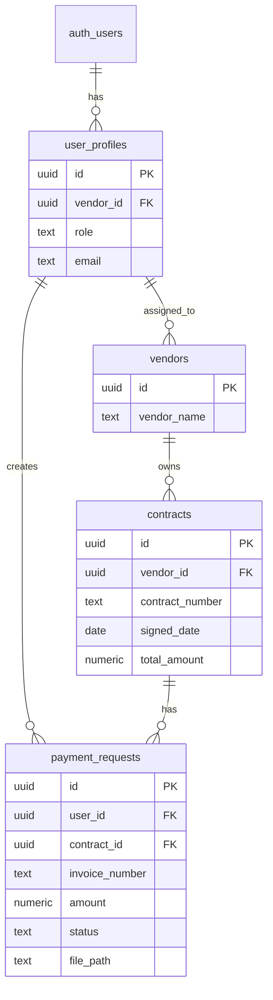

# PayFlow Portal

## Project Description
PayFlow Portal е уеб-базирано приложение за интелигентно управление на финансови заявки, разработено в рамките на курса „Software Technologies with AI“ в SoftUni. 
Системата автоматизира процеса по подаване, проследяване и одобрение на плащания, като осигурява строг контрол на достъпа и сигурност на данните.

**Основни функционалности:**
  *   **Управление на заявки:** Потребителите подават финансови заявки, които се обвързват с конкретни договори.
  *   **Прикачване на документи:** Всяка заявка поддържа прикачване на разходооправдателен документ. Файловете се съхраняват сигурно в Supabase Storage bucket, което осигурява централизирано управление.
  *   **Административен контрол:** Администраторите извършват одобрение на нови потребители и тяхното обвързване към конкретни вендори, гарантирайки, че заявките се подават само по оторизирани договори. 
  Преди финално решение за плащането, администраторът може директно да прегледа прикачения документ в системата, за да гарантира прозрачност и коректност на процеса.
  *   **Dashboard за мониторинг**: Интерактивно табло, визуализиращо статуса на заявките (обработени, чакащи, общ брой) и графичен отчет за разпределението на плащанията по договори.
  *   **Сигурност и ролеви достъп:** Внедрена система за управление на роли и Row-Level Security (RLS) в Supabase за защита на чувствителната финансова информация.

## Architecture
*  **Frontend**: Изграден с чист JavaScript, HTML5, CSS3 и Bootstrap за отзивчив дизайн. Използва се Vite за модулно структуриране на компонентите.
*  **Backend**: Supabase (Database, Auth, Storage). Комуникацията с базата данни се осъществява чрез REST API.
*  **UI/UX Подобрения**: Интегрирана е библиотеката **SweetAlert2** за създаване на стилни и информативни известия. Тя осигурява интуитивна обратна връзка при успешни действия,
  грешки при валидация или потвърждения при изтриване на данни.
* **Communication**: REST API.

## Database Schema
Основните таблици в базата данни са:
*   `**User_profiles**`: Съхранява информация за потребителите, включително техния role (за разграничаване между администратор и потребител) и връзка с конкретен vendor_id.
*   `**vendors**`: Дефинира списъка с партньори/доставчици в системата.
*   `**contracts**`: Свързва договорите с конкретни доставчици (vendor_id), което ограничава обхвата на финансовите заявки.
*   `**payment_requests**`: Централна таблица за финансови заявки, свързана с user_profiles и contracts, съдържаща информация за суми, статус и път до прикачения документ в Storage.
*   `**bucket `payment_documents**`: Съхранение на прикачени файлове към финасовите заявки

## Local Development Setup
1. Клонирай хранилището: **git clone** [https://github.com/3319mvaseva-NEW/PayFlow_portal](https://github.com/3319mvaseva-NEW/PayFlow_portal)
2. Инсталирай зависимостите: **npm install**
3. Конфигурация: Създай **.env** файл в главната директория и добави своите Supabase ключове:
        VITE_SUPABASE_URL=your_supabase_url
        VITE_SUPABASE_ANON_KEY=your_supabase_anon_key
4. База данни и Seed: Приложи миграциите към твоята Supabase инстанция и зареди тестовите данни (seed), за да тестваш приложението веднага с готови потребители, договори и вендори.
Използвай предоставения seed скрипт: **npm run seed:db**
5. Стартирай локално: **npm run dev**

## Testing (Demo Credentials)
Можете да тествате системата с администраторски профил за пълен достъп:
*   **Email**: admin@gmail
*   **Password**: DEMO1234
  
**Работен поток за тестване:**
*   **Регистрация:** Можете да регистрирате нови потребители през формата за регистрация.
*   **Одобрение:** Влезте с администраторския акаунт, за да прегледате новите заявки за регистрация.
*   **Управлениe:** Администраторът обвързва новия потребител с конкретен вендор. След това потребителят може да подава заявки за плащане само по договори на този вендор.
*   **Динамични данни:** Списъците с вендори и договори са динамични – администраторът може да добавя нови записи през панела, което се отразява незабавно в избора на крайните потребители.  

## Key Folders
*   **src/components/:** Съдържа модулни UI елементи (header, footer, layout), които се използват многократно в цялото приложение за поддържане на консистентен дизайн.
*   **src/pages/:** Сърцето на бизнес логиката, разделено на подпапки по функционалности:
*   **admin/:** Панел за управление на потребители, вендори и заявки.
*   **dashboard/:** Интерактивно табло за преглед на финансови показатели и статус на заявките.
*   **login/:** Логика за удостоверяване на потребителите.
*   **payment/:** Модули за създаване на нови заявки и разглеждане на детайли по плащанията.
*   **src/services/:** Централизирана комуникация с бекенда чрез Supabase API (supabase.js) и логика за оторизация (auth.js).
*   **src/styles/:** Глобални стилове на приложението (global.css), осигуряващи единна визия.
*   **src/router.js & main.js**: Основни файлове, управляващи навигацията (routing) и инициализацията на приложението.
*   **supabase/**: Директория с миграции и конфигурация на базата данни, необходими за синхронизация и разгръщане на инфраструктурата.
*   **.github/copilot-instructions.md:** Насоки за AI асистента, гарантиращи спазването на архитектурните стандарти при разработка.
